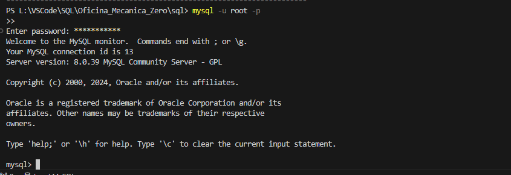
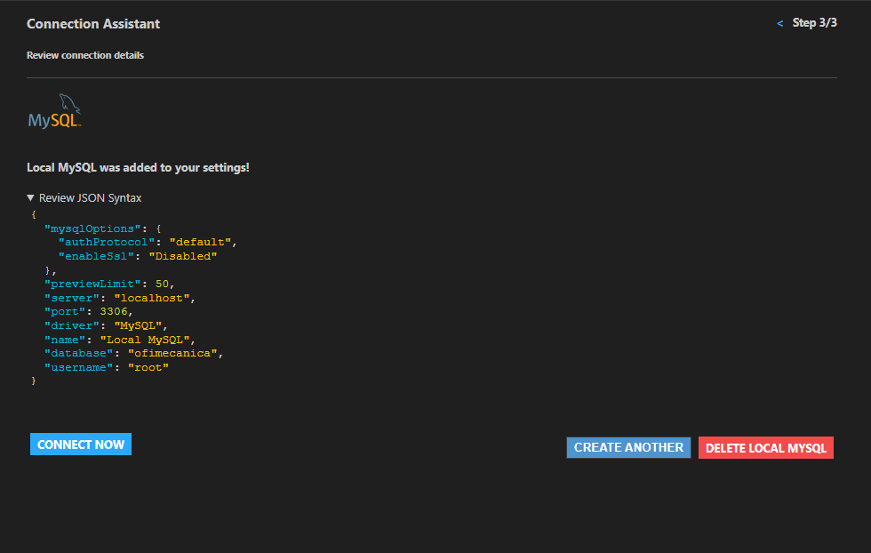
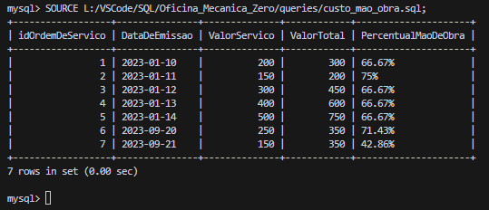
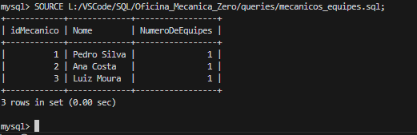
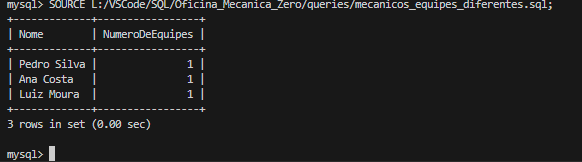
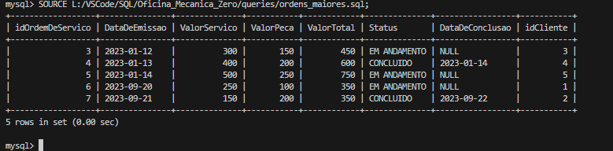
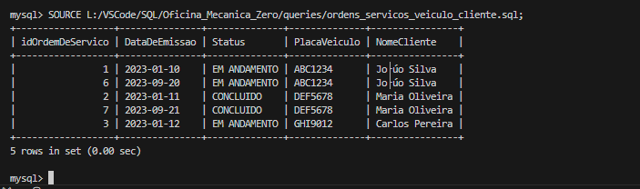
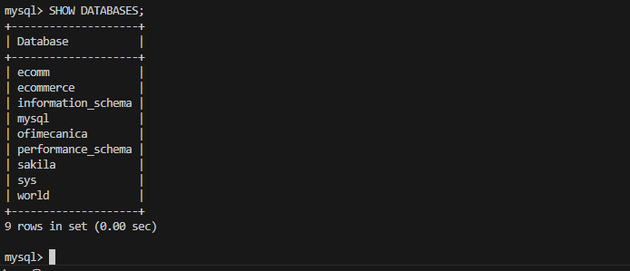

# Sistema de Gestão para Oficina Mecânica

Este projeto foi desenvolvido como parte de um desafio de modelagem de banco de dados e implementação para uma oficina mecânica. Ele abrange desde a criação do esquema conceitual até a implementação prática do banco de dados, passando pela criação de scripts SQL para manipulação e consulta dos dados armazenados.

## Descrição do Desafio

O objetivo deste projeto é utilizar um esquema conceitual criado anteriormente para desenvolver um esquema lógico aplicado ao contexto de uma oficina mecânica. O projeto passou por várias etapas, incluindo:

- **Modelagem do esquema lógico.**
- **Criação de scripts SQL para estruturação do banco de dados.**
- **Inserção de dados fictícios para testes.**
- **Desenvolvimento de consultas SQL complexas para manipulação e análise dos dados.**

## Implementação

### Estrutura do Projeto

A estrutura do projeto é organizada conforme mostrado na imagem abaixo:

   

### Estrutura do Banco de Dados

A estrutura do banco de dados foi desenvolvida para facilitar a gestão e operação de uma oficina mecânica, abordando todos os aspectos necessários desde o atendimento ao cliente até a execução dos serviços mecânicos. Abaixo estão detalhadas as principais tabelas que compõem o sistema:

1. **PessoaFisica**

    idPessoaFisica (INT, PK): Identificador único para cada cliente pessoa física.
    Nome (VARCHAR): Nome do cliente.
    CPF (CHAR): Cadastro de Pessoa Física, único para cada pessoa.
    Endereco (VARCHAR): Endereço residencial do cliente.
    Contato (CHAR): Número de telefone de contato.

2. **PessoaJuridica**

    idPessoaJuridica (INT, PK): Identificador único para cada cliente pessoa jurídica.
    RazaoSocial (VARCHAR): Nome da empresa.
    CNPJ (CHAR): Cadastro Nacional de Pessoa Jurídica, único para cada empresa.
    Endereco (VARCHAR): Endereço comercial da empresa.
    Contato (CHAR): Número de telefone de contato da empresa.

3. **Cliente**

    idCliente (INT, PK): Identificador único para cada cliente, seja pessoa física ou jurídica.
    idPessoaFisica (INT, FK): Referência à tabela PessoaFisica.
    idPessoaJuridica (INT, FK): Referência à tabela PessoaJuridica.

4. **Veiculo**

    idVeiculo (INT, PK): Identificador único para cada veículo.
    idCliente (INT, FK): Referência ao cliente proprietário do veículo.
    PlacaVeiculo (CHAR): Placa de identificação do veículo.

5. **OrdemDeServico**

    idOrdemDeServico (INT, PK): Identificador único para cada ordem de serviço emitida.
    DataDeEmissao (DATE): Data de emissão da ordem de serviço.
    ValorServico (FLOAT): Custo dos serviços realizados.
    ValorPeca (FLOAT): Custo das peças utilizadas.
    ValorTotal (FLOAT): Valor total da ordem de serviço.
    Status (VARCHAR): Status atual da ordem (por exemplo, 'Em andamento', 'Concluído').
    DataDeConclusao (DATE): Data em que a ordem de serviço foi concluída.
    idCliente (INT, FK): Referência ao cliente que solicitou a ordem de serviço.

6. **Conserto**

    idConserto (INT, PK): Identificador único para cada tipo de conserto disponível.
    Descricao (VARCHAR): Descrição detalhada do conserto.

7. **Mecanico**

    idMecanico (INT, PK): Identificador único para cada mecânico.
    Nome (VARCHAR): Nome do mecânico.
    Endereco (VARCHAR): Endereço residencial do mecânico.
    Especialidade (VARCHAR): Área de especialização do mecânico.

8. **Servicos**

    idServicos (INT, PK): Identificador único para cada serviço oferecido pela oficina.
    Descricao (VARCHAR): Descrição do serviço.
    Valor (FLOAT): Custo do serviço.

## Relações

O sistema de gestão para a oficina mecânica foi projetado com uma rede de relacionamentos complexos entre as tabelas para garantir a integridade e a precisão dos dados em todas as operações. Para assegurar que as transações, serviços e relações cliente-veículo sejam consistentemente gerenciadas, várias constraints (restrições) e foreign keys (chaves estrangeiras) são implementadas. Essas são fundamentais para:

- **Garantir Referências Válidas:** As chaves estrangeiras garantem que apenas identificadores válidos de clientes, veículos, mecânicos e serviços sejam inseridos nas tabelas de transações como ordens de serviço, registros de consertos e equipe de mecânicos. Isso previne erros de referência e dados órfãos que poderiam levar a inconsistências.
- **Manter a Consistência dos Dados:** Ao vincular as tabelas através de chaves estrangeiras, o sistema assegura que todas as alterações, atualizações ou exclusões de registros em uma tabela sejam corretamente refletidas em todas as tabelas relacionadas. Por exemplo, se um cliente é excluído, todas as suas ordens de serviço associadas também precisam ser tratadas apropriadamente para evitar registros pendentes sem referência.
- **Validar Integridade dos Dados:** Restrições adicionais, como as de unicidade e as de verificação, são usadas para garantir que dados críticos, como CPF/CNPJ em PessoaFisica e PessoaJuridica, sejam únicos e válidos dentro do contexto do sistema.
- **Facilitar Consultas Complexas:** Os relacionamentos definidos permitem realizar consultas complexas mais facilmente, combinando dados de múltiplas tabelas para fornecer informações detalhadas sobre serviços, ordens de serviço e históricos de clientes e veículos, o que é essencial para uma gestão eficiente.

Esses relacionamentos são cruciais não apenas para a manutenção da integridade dos dados, mas também para apoiar as operações diárias da oficina e oferecer insights através de relatórios detalhados e análises de dados que ajudam na tomada de decisões estratégicas.

## Algumas Imagens do Processo

O projeto inclui imagens explicativas que mostram as etapas do processo de configuração e execução:

1. **A Conexão ao MySQL através do VSCode:**:
   

2. **Configuração do Banco de Dados no VSCode:s**:
   

3. **Consulta de Custos de Mão de Obra:**:
   

4. **Consulta de Mecânicos por Equipes:**:
   

5. **Consulta de Mecânicos em Equipes Diferentes:**:
   

6. **Consulta de Maiores Ordens de Serviço:**:
   

7. **Consulta de Ordens de Serviço por Veículo e Cliente:**:
   

8. **Verificação de Existência do Banco de Dados no MySQL:**:
   

Essas imagens e outras demonstram a execução correta dos passos do projeto e podem ser encontradas na pasta `img` do repositório.

## Ferramentas e Tecnologias Utilizadas

1. **MySQL:** Sistema de gerenciamento de banco de dados para a criação e manipulação de dados.
2. **Python:** Linguagem de programação utilizada para scripts de automação e conexão com o banco de dados.
3. **Virtualenv:** Ferramenta utilizada para criar ambientes Python isolados.
4. **MySQL Connector Python:** Biblioteca utilizada para conectar o Python ao MySQL.
5. **Visual Studio Code:** Editor de código utilizado para o desenvolvimento do projeto.

## Scripts Implementados

Os scripts SQL são essenciais para a criação, manipulação e consulta de dados dentro do banco de dados do sistema de gestão da oficina mecânica. Eles facilitam a configuração inicial do banco de dados, a inserção de dados para testes e a execução de consultas complexas para análise dos dados. Segue uma descrição dos principais scripts utilizados:

1.**schema_creation.sql**

Este arquivo contém os comandos SQL para criar as tabelas do banco de dados e definir suas relações. Ele é executado diretamente no MySQL Workbench ou através de um terminal MySQL para estabelecer a estrutura base do banco de dados.

2.**data_insertion.sql**

Após a criação das tabelas, este script é responsável por inserir dados fictícios nas tabelas do banco de dados. Isso é essencial para realizar testes e validar a configuração das tabelas e relações.

3.**queries.sql**

Este arquivo contém várias consultas SQL complexas que são usadas para extrair informações significativas do banco de dados. As consultas implementam cláusulas como JOIN, GROUP BY, HAVING e ORDER BY para fornecer respostas detalhadas e insights baseados nos dados.

4.**migration_v1.sql**

Este script de migração é utilizado para fazer alterações estruturais no banco de dados após a implementação inicial. Pode incluir adições de novas tabelas, alterações em colunas existentes, ou ajustes em restrições e índices.

5.**test_constraints.sql**

Este arquivo realiza testes para garantir que as constraints do banco de dados, como primary keys, foreign keys e unique constraints, estejam funcionando corretamente. Isso é crucial para manter a integridade e consistência dos dados.

6.**test_queries.sql**

Este script contém consultas SQL usadas para testar e validar a consistência e a integridade dos dados inseridos no banco de dados. Ele ajuda a garantir que as operações de inserção, atualização e exclusão estão produzindo os resultados esperados.

7.**app.py**

Este arquivo Python é responsável por conectar-se ao banco de dados e executar funções que realizam consultas SQL, processam resultados e exibem dados. Ele atua como uma interface entre o usuário e o banco de dados.

8.**config.py**

Contém as configurações de conexão com o banco de dados, como o host, usuário, senha e o nome do banco de dados. Essas credenciais são usadas no arquivo app.py para estabelecer uma conexão com o banco de dados.

## Consultas SQL Adequadas às Diretrizes do Projeto

1. Consulta Simples com SELECT Statement
-- Consulta para listar todos os mecânicos e suas especialidades
SELECT Nome, Especialidade FROM Mecanico;

2. Consulta com Filtros usando WHERE Statement
-- Consulta para encontrar ordens de serviço que tenham um valor total superior a R$ 300,00
SELECT * FROM OrdemDeServico
WHERE ValorTotal > 300;

3. Criação de Atributos Derivados
-- Consulta para calcular o custo de mão de obra como uma porcentagem do valor total da ordem de serviço
SELECT idOrdemDeServico, DataDeEmissao, ValorServico, ValorTotal,
       CONCAT(ROUND((ValorServico / ValorTotal) * 100, 2), '%') AS PercentualMaoDeObra
FROM OrdemDeServico;

4. Ordenação dos Dados com ORDER BY
-- Consulta para listar veículos e seus donos em ordem alfabética pelo nome do cliente
SELECT V.PlacaVeiculo, P.Nome
FROM Veiculo V
JOIN Cliente C ON V.idCliente = C.idCliente
JOIN PessoaFisica P ON C.idPessoaFisica = P.idPessoaFisica
ORDER BY P.Nome;

5. Filtrar Grupos com HAVING Statement
-- Consulta para listar mecânicos que trabalham em mais de 3 equipes diferentes
SELECT M.Nome, COUNT(E.idEquipeMecanicos) AS NumeroDeEquipes
FROM Mecanico M
JOIN EquipeMecanicos E ON M.idMecanico = E.idMecanico
GROUP BY M.Nome
HAVING NumeroDeEquipes > 3;

6. Junções Complexas entre Tabelas
-- Consulta para listar todas as ordens de serviço com detalhes do veículo e do cliente
SELECT OS.idOrdemDeServico, OS.DataDeEmissao, OS.Status, V.PlacaVeiculo, PF.Nome AS NomeCliente
FROM OrdemDeServico OS
JOIN Cliente C ON OS.idCliente = C.idCliente
JOIN PessoaFisica PF ON C.idPessoaFisica = PF.idPessoaFisica
JOIN Veiculo V ON C.idCliente = V.idCliente;

Essas consultas cobrem uma ampla gama de funcionalidades SQL e ajudarão você a explorar os dados em sua base de forma detalhada e complexa. Elas podem ser usadas como base para criar consultas ainda mais específicas ou complexas dependendo das necessidades específicas de análise de dados ou relatórios que você possa ter.

## Conexão ao MySQL através do VSCode

1. Conectar ao MySQL

    Certifique-se de que você está conectado ao servidor MySQL onde seu banco de dados está hospedado. Você normalmente inicia a sessão com um comando semelhante a:

    mysql -u seu_usuario -p

2. Selecionar o Banco de Dados

    Antes de executar suas consultas, certifique-se de selecionar o banco de dados correto:

    USE nome_do_seu_banco_de_dados;

    Substitua nome_do_seu_banco_de_dados pelo nome real do seu banco de dados.

3. Executar Consultas

    Digite suas consultas diretamente no prompt e pressione Enter para executá-las. Por exemplo:

    -- Consulta para listar todos os mecânicos e suas especialidades
    SELECT Nome, Especialidade FROM Mecanico;

    Pressione Enter após digitar a consulta para que o MySQL processe e retorne os resultados.

4. Ver os Resultados

    Os resultados da sua consulta serão exibidos diretamente no console. Para consultas de seleção, você verá uma tabela com os resultados. Para operações de inserção, atualização ou exclusão, você verá uma mensagem indicando o número de linhas afetadas.

5. Modificar e Reexecutar Consultas

    Você pode editar e reexecutar consultas diretamente no prompt. Alguns clientes de linha de comando oferecem funcionalidades como o histórico de comandos, que você pode acessar usando as setas para cima e para baixo no teclado. Isso facilita a modificação e reexecução de comandos recentes.

6. Sair do MySQL

    Quando terminar de executar suas consultas, você pode sair do cliente MySQL digitando:

    exit

### Dicas Adicionais

1. **Formatação:** Para melhorar a legibilidade das consultas e resultados, especialmente ao lidar com muitas colunas ou linhas, considere utilizar ferramentas de formatação SQL ou interfaces gráficas como MySQL Workbench ou phpMyAdmin.

2. **Segurança:** Sempre tenha cuidado ao executar consultas que modificam dados (INSERT, UPDATE, DELETE). Certifique-se de que está operando no ambiente correto (desenvolvimento, teste, produção) e que possui backups adequados.

Essa é a maneira básica de testar e trabalhar com suas consultas SQL diretamente do prompt do MySQL

## Dependências

Para instalar as dependências do projeto, execute:

    pip install -r requirements.txt

## Executando o Projeto

Para executar o projeto, é necessário ativar o ambiente virtual e rodar os scripts Python que interagem com o banco de dados.

    source .venv/bin/activate  # Ativar o ambiente virtual no macOS/Linux
    .venv\Scripts\activate     # Ativar o ambiente virtual no Windows
    python app.py              # Executar o script principal

## Dificuldades Encontradas

Durante o desenvolvimento do projeto, enfrentamos várias dificuldades, incluindo:

- Desafios na configuração do ambiente virtual devido a especificidades do sistema operacional.
- Complexidades na formulação de consultas SQL que envolvem múltiplas junções e cláusulas avançadas.
- Gestão de dependências entre as tabelas, especialmente ao deletar ou atualizar registros devido a restrições de chave estrangeira.

## Galeria de Imagens do Projeto

Abaixo estão as imagens que detalham diversas partes do projeto:

## Conclusão

Este projeto demonstrou a aplicabilidade prática de conceitos avançados de banco de dados em um cenário real de gestão de uma oficina mecânica. As habilidades desenvolvidas neste projeto são essenciais para a gestão eficiente de dados em ambientes empresariais.
